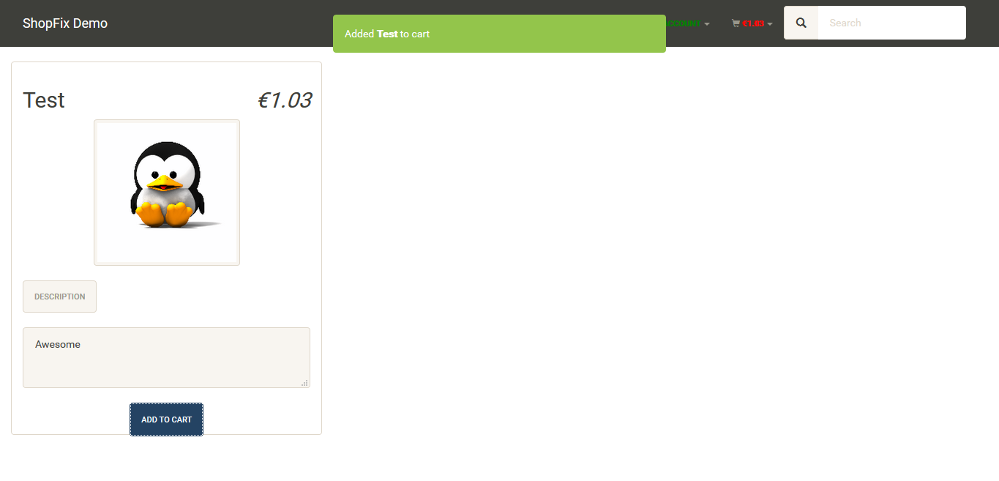
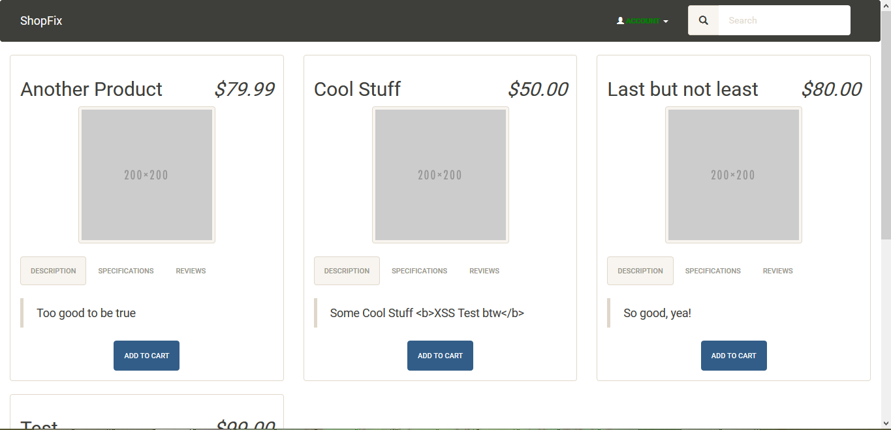
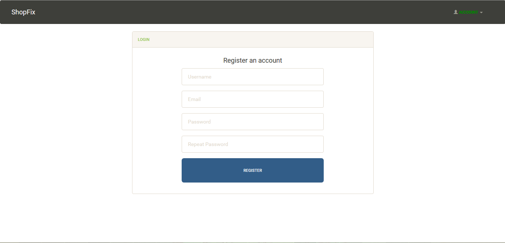
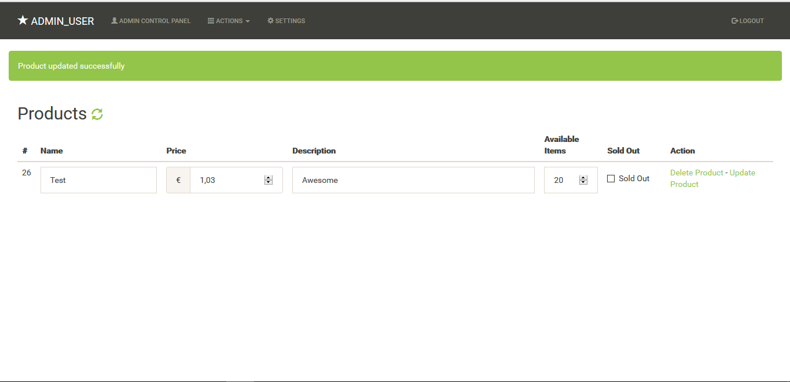
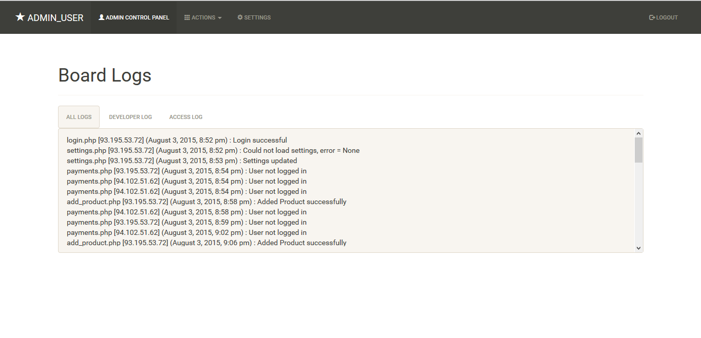

# ShopFix
- Bootstrap Based Shop System
- Uses AngularJS

## Features: ##
#### User perspective: ####
- Sign up as a customer
- Add Items to cart
- Checkout using PayPal or Bitcoin
- Download purchased items via Purchase History

#### Admin perspective: ####
- Logging System to monitor what is happening
- Add Products
- Change Product details
- View Customers
- Renew Customer password if lost
- Set PayPal API credentials
- Set Bitcoin API Credentials
- Set site Title
- Set google reCaptcha settings

#### General: ####
- High security standards (besides that it is open source :P)
- Secure coding, encrypted data with blowfish + iv
- Massive use of CSRF Tokens

#### To be done: ####
- Check for installed modules
- Installation script to create database tables and so on
- Further exception handling
- Stripe checkout to make it easier (also support for credit cards)

Check [tobedone.txt](tobedone.txt)

and much more...

## Images: ##

- by Janosch Hübner
